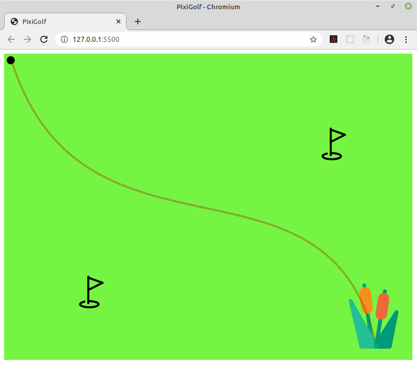

## Кривая безье с двумя контрольными точками на базе PixiJS
\
Добавил немного юмора и визуала от себя: мяч (для гольфа, ага) -- начальная точка; лунки -- интерактивные контрольные точки; камыши -- конечная точка. Мяч всегда оказывается в камышах, как бы ты не подставлял лунки под его траекторию.

Чтобы поиграться в своем браузере, надо запустить из папки project локальный сервер (я использую Live Server для VS Code).
\
\
\

